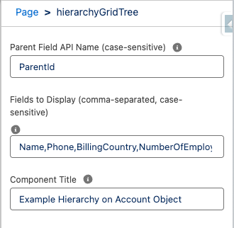
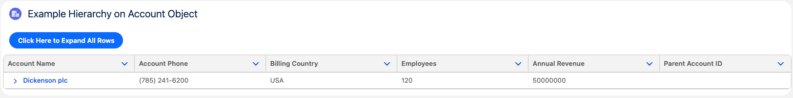
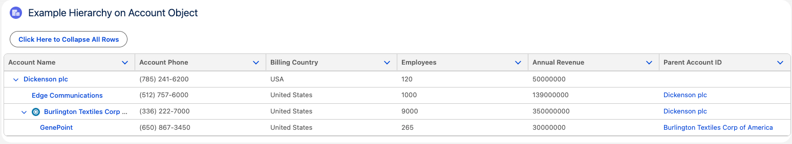
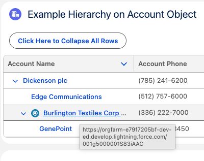
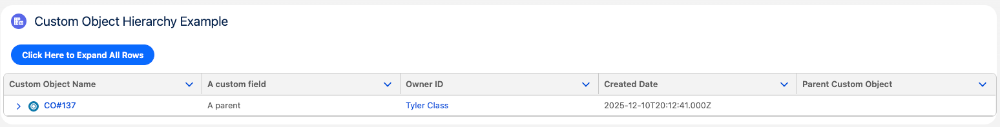
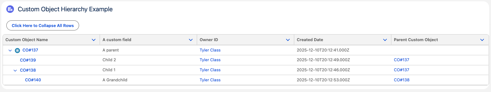

# 🔁 Salesforce LWC: Generic Hierarchy Tree Grid

A Lightning Web Component (LWC) that displays hierarchical data for **any SObject** in a nested tree grid format. Originally built for `Account`, this component has been enhanced to support any standard or custom object using dynamic metadata and recursive Apex.


## 📌 Features

- 💡 Supports **any object** with hierarchical relationships via a parent lookup field  
- 🌲 Displays data in a **tree grid** with expandable/collapsible rows  
- 🔗 Automatically links **lookup fields** and **record names** to their record pages  
- 🔄 Recursively fetches data via **Apex** and dynamically builds the hierarchy  
- ⚙ Configurable via Lightning App Builder with properties for title, fields, and parent field  


## ⚙ Setup & Usage

### 1. **Clone or deploy the component**
If using SFDX:

```bash
sfdx force:source:deploy -p force-app/main/default/lwc/hierarchyGridTree
sfdx force:source:deploy -p force-app/main/default/classes/HierarchicalRecordController.cls
```

### 2. **Add to Lightning Record Page**
- Go to the **Lightning App Builder**
- Add the `Hierarchy Grid Tree` component
- Set the following configuration options:
  - `title`: Custom title (e.g. "Account Hierarchy")
  - `parentFieldApiName`: Case-sensitive API name of the parent lookup field (e.g. `ParentId`)
  - `fieldList`: Comma-separated list of fields to display (e.g. `Name,OwnerId,ParentId`)


## 🧪 Test Class

Apex test class included:

- ✅ 100% code coverage  
- ✅ Verifies record hierarchy from multiple entry points  
- ✅ Tests dynamic field resolution including lookup relationships  

Class: `HierarchicalRecordControllerTest.cls`

To run tests:

```bash
sfdx force:apex:test:run --classnames HierarchicalRecordControllerTest --resultformat human --outputdir test-results --codecoverage
```


## 🔧 Component Properties (Design-Time Config)

| Property              | Required | Description |
|-----------------------|----------|-------------|
| `recordId`            | ✅ (auto) | Provided by the record page |
| `objectApiName`       | ✅ (auto) | Provided by the record page |
| `title`               | ❌        | Title displayed on top of the grid |
| `fieldList`           | ✅        | Comma-separated API names of fields to show |
| `parentFieldApiName`  | ✅        | API name of the parent lookup field used to build the hierarchy |


## 🧠 How It Works

1. **LWC** uses `@wire(getObjectInfo)` to dynamically read field labels and relationships.  
2. **Apex controller**:
   - Finds the **topmost parent** via upward recursion.
   - Retrieves all **descendants** via downward recursion.
   - Dynamically includes lookup fields like `Owner.Name` in the query.
3. Component constructs a **hierarchical structure** compatible with `<lightning-tree-grid>`.  
4. Lookup fields and record names are rendered as **clickable links**.


## 📎 Useful Salesforce Docs

- Tree Grid LWC: https://developer.salesforce.com/docs/component-library/bundle/lightning-tree-grid  
- Apex Schema Describe: https://developer.salesforce.com/docs/atlas.en-us.apexref.meta/apexref/apex_class_Schema_DescribeFieldResult.htm  
- LWC Get Object Info: https://developer.salesforce.com/docs/component-library/documentation/en/lwc/lwc.reference_wire_adapters_get_object_info  


## 🧼 Notes & Best Practices

- The component expects **valid field API names** — be careful with typos in `fieldList`.  
- Works best on objects with clear parent-child hierarchy (e.g. Account, Region, Custom__c).  
- You can extend the Apex logic to include filtering, field sets, or pagination if needed.  


## 🧱 Folder Structure

```
force-app
└── main
    └── default
        ├── lwc
        │   └── hierarchyGridTree
        └── classes
            └── HierarchicalRecordController.cls
```

## 📸 Visual Walkthrough

### 🔷 **Account Object Example**

#### ⚙️ Configuration Panel

Configure the component for the `Account` object using component metadata:




#### 🔽 Collapsed View (Default)

The grid tree renders in collapsed state on page load:




#### 🔼 Expanded View

Once expanded, you can see the full hierarchy (note the icon showing the current record):




#### 🔗 Hyperlinked Records

Lookup and name fields are rendered as clickable links:




### 🟣 **Custom Object Example**

#### ⚙️ Configuration Panel

Example configuration for a custom object with a parent lookup:


#### 🔽 Collapsed View

Initial load is collapsed:




#### 🔼 Expanded View

Expanded view showing the full custom object hierarchy:




## 🙌 Author & Credits

Originally created by Tyler Class 12/10/2025 | [www.tylerclass.net](https://tylerclass.net) | [www.github.com/tyler-class](https://github.com/tyler-class)

